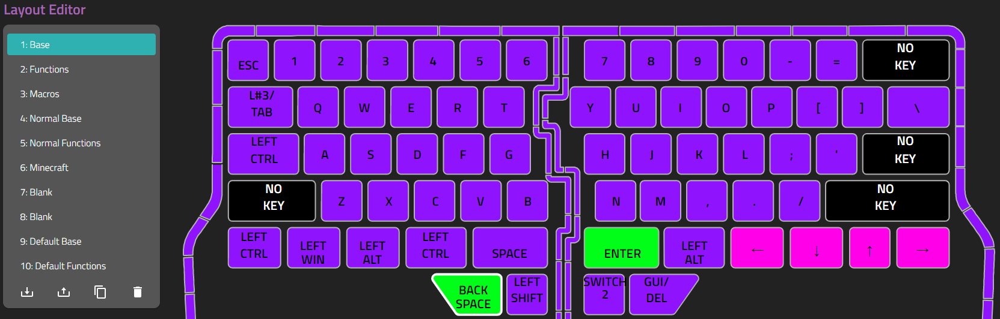
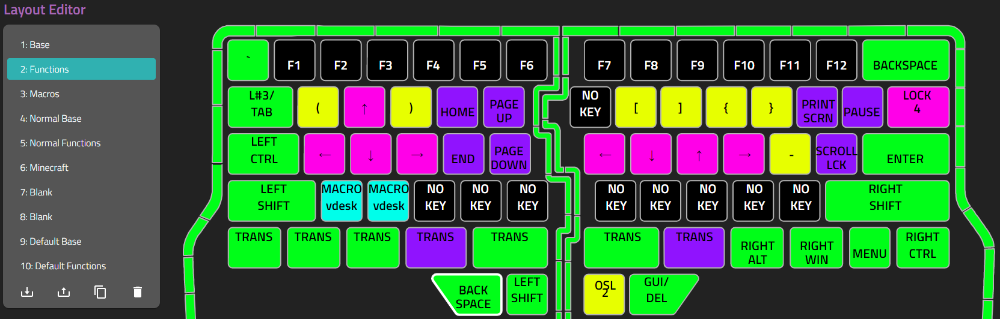
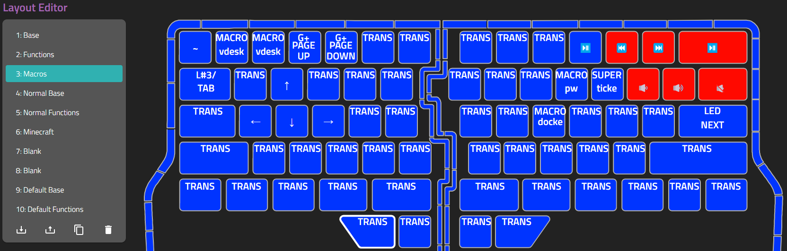
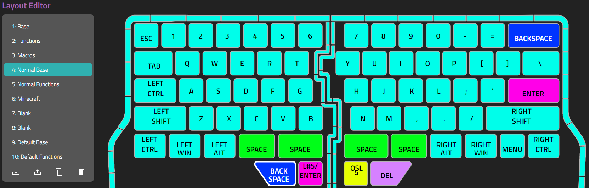
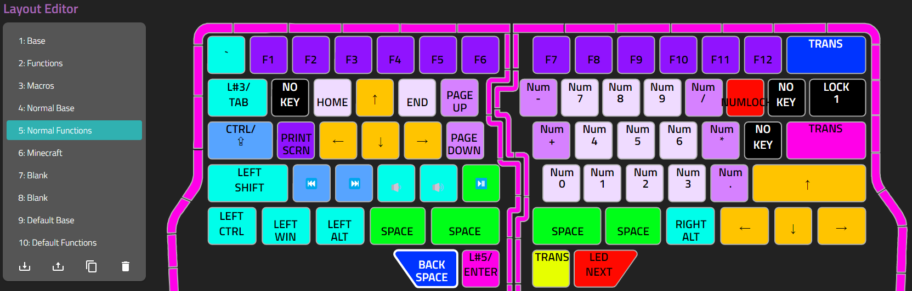
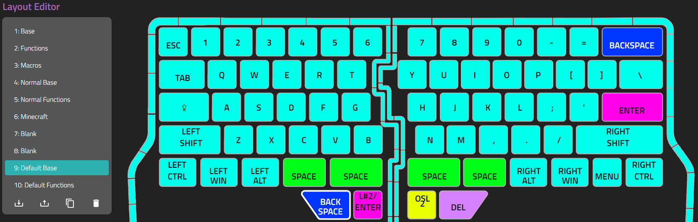
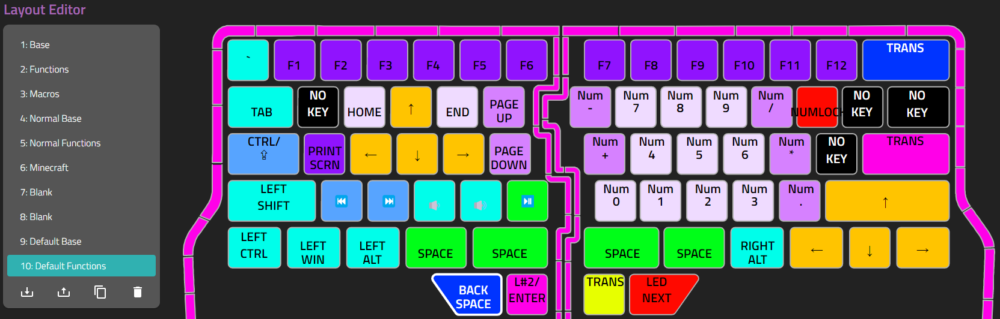

# Dygma Raise Layouts

## Layer 1 - Base

Main typing. Added backspace and enter to the thumb cluster on 4/1/2022

* Do I really need three control keys on one side of board?

)

## Layer 2 - Functions

Function / Extra keys, some macros. Lots of room for expansion.

* Added () [] {} and - to this layer on 4/20/22
* Do I need three sets of arrow keys?
* Can lock to layer4 for normal typing if needed.

Hold 'Tab' to access Audio controls, macros and more arrows.

* Macros
* Type frequently repeated commands
* Change virtual desktops, cycle through apps in powertoys zones
* Need more ideas
  
## Layer 3 - Macros

## Layer 4 - Normal Base

If I need to play a game or type something normally for some reason. These are more or less the default layouts with changes for getting out of layer

## Layer 5 - Normal Functions

## Layer 6 - Minecraft

I needed this to do something in minecraft once. Maybe I'll need it again

## Layer 7 & 8 - Blank

Unused, blank layers

## Layer 9 - Default Base

The included base layer, for reference

## Layer 10 - Default Functions

The included function layer, for reference

